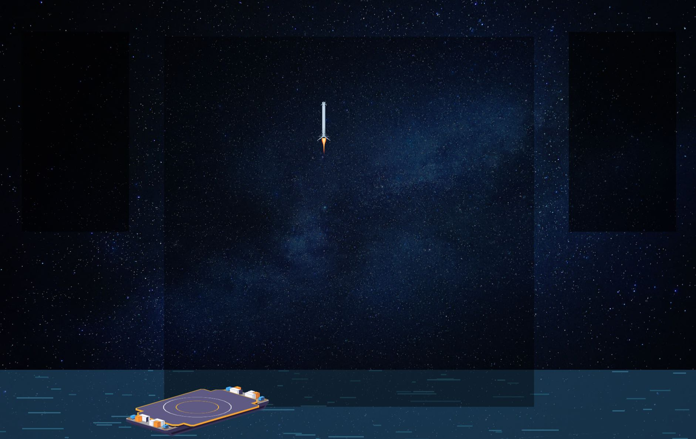

# Rocket Test

SpaceX have forgotten to build a control system for their next rocket!

They just realised this small problem while the rocket was in flight, so your mission to is quickly build one in ReactJS.



# Endpoints

Server location: https://rocket.theninja.life

## HTTP

### GET /api/state/{githubUsername}

Payload: N/A

Response:

```json
{
	"Barge": {
		"Position": {
			"X": 887,
			"Y": -50
		}
	},
	"Rocket": {
		"Position": {
			"X": 81,
			"Y": -1.0000000000020464
		},
		"Angle": 90,
		"VernierThruster": 0,
		"Thrust": 0,
		"Speed": 120
	},
	"Message": "You missed the barge!"
}
```

### POST /api/start/{githubUsername}

Payload: N/A

Response: N/A

### POST /api/thrust/{githubUsername}

Payload:

```json
{
	"Thrust": 10
}
```

Response: N/A

### POST /api/vernierthrust/{githubUsername}

Payload:

```json
{
	"VernierThrust": 10
}
```

Response: N/A

## Websockets

### /ws/rocket/{githubUsername}

Payload:

```json
{
	"Barge": {
		"Position": {
			"X": 887,
			"Y": -50
		}
	},
	"Rocket": {
		"Position": {
			"X": 81,
			"Y": -1.0000000000020464
		},
		"Angle": 90,
		"VernierThruster": 0,
		"Thrust": 0,
		"Speed": 120
	},
	"Message": "You missed the barge!"
}
```

# Tasks

* Fix any errors

* Build a control panel -> Start instance -> Set username -> Set thrust -> Set vernier thrust

* Build a metrics panel -> Show rocket position -> Show rocket velocity -> Show rocket angle -> Show barge position -> Show remaining distance to target
